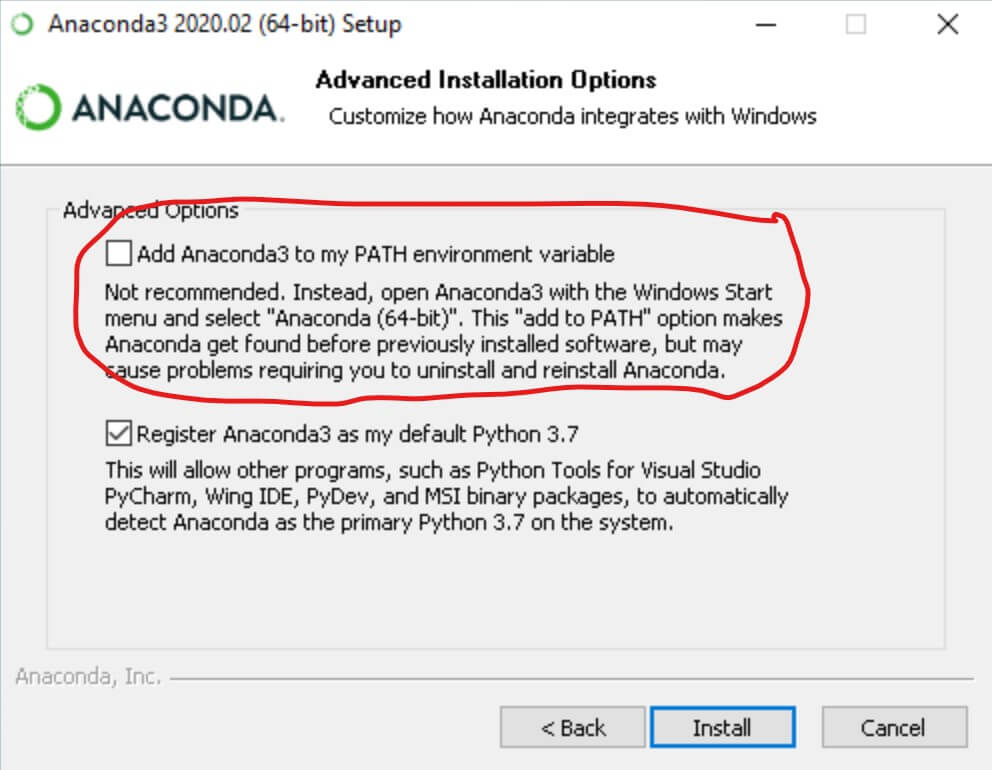

# Anaconda Install

 To complete the assignments you first need to download and install [Anaconda](https://www.anaconda.com/).

## IMPORTANT!!!

 When installing Anaconda you will receive the following prompt:
 
 In order for the scripts to work you need to make sure "Add Anaconda to my PATH environment variable" is selected.

 After installing Anaconda simply clone the repository and open "run_notebook.bat". This will automatically create a virtual environment and open jupyter in a new browser tab.

 Good luck with your assignments!